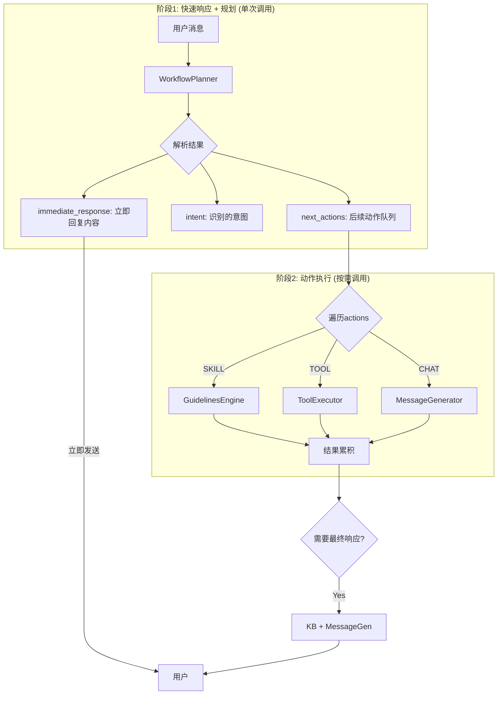

# Model-Driven Workflow + Skills 架构方案

## 一、架构概览

```
┌──────────────────────────────────────────────────────────────────────────┐
│                         Agent 执行层                                      │
│                                                                          │
│   ┌────────────────────────────────────────────────────────────────────┐ │
│   │            Workflow Engine (模型驱动SOP - 主干)                     │ │
│   │                                                                    │ │
│   │   [Entry] ──→ [Intent] ──→ [Node...] ──→ [Response+KB]            │ │
│   │                  │                            ↑                    │ │
│   │                  ↓ 意图命中                   │                    │ │
│   │            ┌───────────┐                      │                    │ │
│   │            │  Skills   │ ──────────────────────                    │ │
│   │            │(Guidelines)│    执行结果返回主干                       │ │
│   │            └───────────┘                                           │ │
│   └────────────────────────────────────────────────────────────────────┘ │
│                               ↑                                          │
│                          共享上下文                                       │
│                               ↓                                          │
│   ┌────────────────────────────────────────────────────────────────────┐ │
│   │          Guidelines Engine (ARQs - 独立引擎)                        │ │
│   │                                                                    │ │
│   │   保持原有: Matcher → ToolCalls → MessageGen                       │ │
│   └────────────────────────────────────────────────────────────────────┘ │
│                                                                          │
│   ┌──────────────────┐  ┌──────────────────┐  ┌──────────────────┐      │
│   │   Tools/MCP      │  │  Knowledge Base  │  │   Shared Context │      │
│   │   (全局可用)      │  │  (输出前注入)    │  │   (聊天历史等)   │      │
│   └──────────────────┘  └──────────────────┘  └──────────────────┘      │
└──────────────────────────────────────────────────────────────────────────┘
```

## 二、核心设计原则

| 原则 | 说明 |
|------|------|
| **原子化** | 组件单一职责，可独立测试 |
| **可插拔** | 引擎间通过接口解耦 |
| **共享上下文** | 避免数据复制，统一状态源 |
| **模型驱动** | Workflow由LLM评估推进 |

## 三、分层架构


## 四、核心组件设计

### 4.1 SharedContext (共享上下文)

```python
@dataclass
class SharedContext:
    """
    统一上下文容器 - 所有引擎共享
    避免数据传递复制
    """
    # === 不可变 ===
    session: Session
    agent: Agent
    customer: Customer | None
    
    # === 可变状态 ===
    interaction: Interaction          # 当前对话
    variables: dict[str, Any]         # 上下文变量
    tool_results: list[ToolResult]    # 工具执行结果
    
    # === Workflow状态 ===
    workflow_state: WorkflowState | None
    
    def snapshot(self) -> "ContextSnapshot":
        """创建只读快照，用于并行执行"""
        ...
```

### 4.2 WorkflowEngine (主干引擎)

```python
class WorkflowEngine:
    """
    模型驱动的SOP执行引擎
    - 自动进入workflow流程
    - 通过LLM评估推进节点
    - Skills命中时调用GuidelinesEngine
    """
    
    def __init__(
        self,
        guidelines_engine: GuidelinesEngine,  # 注入，不继承
        tool_executor: ToolExecutor,
        message_generator: MessageGenerator,
    ):
        self._guidelines = guidelines_engine
        self._tools = tool_executor
        self._msg_gen = message_generator
    
    async def process(
        self, 
        ctx: SharedContext,
        workflow: WorkflowGraph,
        emitter: EventEmitter
    ) -> None:
        """主处理流程"""
        state = ctx.workflow_state or self._init_state(workflow)
        
        while not state.is_terminal:
            node = workflow.nodes[state.current_node]
            result = await self._execute_node(node, ctx, emitter)
            
            # 更新状态
            state.update(result)
            ctx.workflow_state = state
            
            if result.wait_for_input:
                break
```

### 4.3 GuidelinesEngine (Skills引擎)

```python
class GuidelinesEngine:
    """
    ARQs执行引擎 - 保持原有逻辑
    作为独立组件被Workflow调用
    """
    
    async def execute_as_skill(
        self,
        skill_config: SkillConfig,
        ctx: SharedContext,
        emitter: EventEmitter
    ) -> SkillResult:
        """
        被Workflow调用的入口
        - 复用原有 _do_process 核心逻辑
        - 直接操作 SharedContext
        """
        # 1. 构建内部执行上下文
        loaded_ctx = self._build_loaded_context(ctx)
        
        # 2. 强制注入匹配的guidelines (跳过匹配阶段)
        if skill_config.guidelines:
            loaded_ctx.state.guideline_matches = [
                GuidelineMatch(g, score=1.0, rationale="Skill强制执行")
                for g in skill_config.guidelines
            ]
        
        # 3. 执行工具调用 (原有逻辑)
        await self._call_tools(loaded_ctx, emitter)
        
        # 4. 同步结果到SharedContext
        ctx.tool_results.extend(loaded_ctx.state.tool_events)
        ctx.variables.update(loaded_ctx.state.context_variables)
        
        return SkillResult(
            tool_events=loaded_ctx.state.tool_events,
            variables=loaded_ctx.state.context_variables
        )
```

### 4.4 ToolExecutor (工具执行器)

```python
class ToolExecutor:
    """
    独立工具执行组件
    - 供Workflow直接调用
    - 供GuidelinesEngine调用
    """
    
    async def execute(
        self,
        tools: list[ToolId],
        ctx: SharedContext,
        instruction: str | None = None
    ) -> list[ToolResult]:
        """
        执行工具并写入SharedContext
        """
        results = []
        for tool_id in tools:
            result = await self._invoke_tool(tool_id, ctx, instruction)
            results.append(result)
            ctx.tool_results.append(result)
        return results
```

### 4.5 MessageGenerator (响应生成)

```python
class MessageGenerator:
    """
    响应生成 - 最终阶段
    在此处注入Knowledge Base结果
    """
    
    def __init__(self, knowledge_retriever: KnowledgeRetriever | None):
        self._knowledge = knowledge_retriever
    
    async def generate(
        self,
        ctx: SharedContext,
        action: str,
        emitter: EventEmitter
    ) -> MessageEvent:
        """
        生成响应
        1. 知识库检索 (如配置)
        2. 构建prompt
        3. LLM生成
        """
        # 1. 知识库检索 (仅在此处)
        kb_results = []
        if self._knowledge:
            kb_results = await self._knowledge.retrieve(ctx)
        
        # 2. 构建prompt
        prompt = self._build_prompt(
            ctx=ctx,
            action=action,
            knowledge=kb_results
        )
        
        # 3. 生成
        return await self._generate(prompt, emitter)
```

## 五、模型交互策略

### 5.1 问题分析

一个请求需要多种处理：
1. **立即回复** - 打招呼/确认收到
2. **意图识别** - 匹配分支
3. **动作执行** - Skills/Tools/其他节点
4. **最终响应** - 是否需要再次回复

### 5.2 策略对比

| 策略 | 优点 | 缺点 | 适用场景 |
|------|------|------|----------|
| **单次调用** | 低延迟、简单 | Prompt复杂、难调试 | 简单流程 |
| **多次调用** | 清晰、可控 | 高延迟、高成本 | 复杂流程 |
| **混合策略** | 平衡延迟与准确 | 实现复杂 | **推荐** |

### 5.3 推荐方案：两阶段混合



### 5.4 WorkflowPlanner 设计

```python
@dataclass
class PlanResult:
    """规划结果 - 单次调用返回"""
    immediate_response: str | None    # 立即回复 (打招呼)
    intent: str                       # 识别的意图
    next_actions: list[Action]        # 后续动作队列
    need_final_response: bool         # 是否需要最终响应

class WorkflowPlanner:
    """
    单次调用完成: 快速回复 + 意图识别 + 动作规划
    """
    
    async def plan(
        self,
        ctx: SharedContext,
        workflow_prompt: str,  # 自定义workflow prompt
        user_message: str
    ) -> PlanResult:
        
        prompt = f"""
{workflow_prompt}

当前用户消息: {user_message}
对话历史: {ctx.interaction.history}

请分析并返回JSON:
{{
    "immediate_response": "如需立即回复用户的内容，否则null",
    "intent": "识别的用户意图",
    "next_actions": [
        {{"type": "SKILL", "skill_id": "...", "reason": "..."}},
        {{"type": "TOOL", "tool_id": "...", "params": {{...}}}},
        ...
    ],
    "need_final_response": true/false
}}
"""
        
        result = await self._llm.generate_json(prompt)
        return PlanResult(**result)
```

### 5.5 执行流程

```python
async def process(self, ctx: SharedContext, user_message: str):
    # ========== 阶段1: 规划 (单次调用) ==========
    plan = await self._planner.plan(ctx, self._workflow_prompt, user_message)
    
    # 立即回复 (如有)
    if plan.immediate_response:
        await self._emit_response(plan.immediate_response)
    
    # ========== 阶段2: 执行动作队列 ==========
    for action in plan.next_actions:
        match action.type:
            case "SKILL":
                await self._guidelines.execute_as_skill(action, ctx)
            case "TOOL":
                await self._tools.execute(action, ctx)
            case "CHAT":
                # 中间响应
                await self._msg_gen.generate(ctx, action.prompt)
    
    # ========== 阶段3: 最终响应 (如需) ==========
    if plan.need_final_response:
        # KB检索 + 生成
        kb_results = await self._kb.retrieve(ctx) if self._kb else []
        await self._msg_gen.generate(ctx, plan.intent, kb_results)
```

### 5.6 知识库时序保证


**关键保证:** KB检索在最终响应生成前完成，结果直接注入MessageGenerator。

## 六、动作类型详解

### 6.1 动作类型矩阵

| 动作类型 | 说明 | AI参与 | 消息生成 | 接管流程 |
|----------|------|--------|----------|----------|
| **SKILL** | 执行Guidelines (ARQs) | ✅ | ✅ 执行后生成 | ❌ |
| **TOOL** | 调用工具获取数据 | ✅ | ✅ 执行后生成 | ❌ |
| **FLOW** | 固定规则流程 | ❌ | ❌ 完全接管 | ✅ |
| **NO_ACTION** | 无匹配动作 | ✅ | ✅ 直接生成 | ❌ |

### 6.2 完整执行流程


### 6.3 各动作类型详解

#### 6.3.1 SKILL - Guidelines执行

```python
@dataclass
class SkillAction:
    type: Literal["SKILL"] = "SKILL"
    skill_id: str                    # Skill/Guidelines组ID
    guidelines: list[Guideline]      # 或直接指定guidelines
    tools: list[ToolId] | None       # 关联工具

class SkillExecutor:
    """
    执行Guidelines (ARQs逻辑)
    执行完成后 → 必须回到MessageGenerator生成响应
    """
    
    async def execute(
        self,
        action: SkillAction,
        ctx: SharedContext
    ) -> SkillResult:
        # 1. 调用GuidelinesEngine执行
        result = await self._guidelines_engine.execute_as_skill(
            skill_config=action,
            ctx=ctx
        )
        
        # 2. 结果写入Context (供后续消息生成使用)
        ctx.variables["skill_result"] = result.data
        ctx.tool_results.extend(result.tool_events)
        
        # 3. 返回结果 (不生成消息，由主流程统一处理)
        return SkillResult(
            success=True,
            data=result.data,
            need_message_gen=True  # 标记需要消息生成
        )
```

**执行流程:**
```
SKILL执行 → 工具调用(如有) → 结果存Context → KB检索 → MessageGenerator → 响应
```

#### 6.3.2 TOOL - 工具执行

```python
@dataclass
class ToolAction:
    type: Literal["TOOL"] = "TOOL"
    tool_ids: list[str]              # 工具ID列表
    params: dict | None              # 调用参数
    instruction: str | None          # 工具使用说明

class ToolExecutor:
    """
    直接调用工具
    执行完成后 → 必须回到MessageGenerator生成响应
    """
    
    async def execute(
        self,
        action: ToolAction,
        ctx: SharedContext
    ) -> ToolResult:
        results = []
        
        for tool_id in action.tool_ids:
            # 执行工具
            result = await self._invoke_tool(
                tool_id=tool_id,
                params=action.params,
                ctx=ctx
            )
            results.append(result)
            
            # 写入Context
            ctx.tool_results.append(result)
        
        # 汇总结果存入variables
        ctx.variables["tool_results"] = results
        
        return ToolResult(
            success=True,
            data=results,
            need_message_gen=True  # 标记需要消息生成
        )
```

**执行流程:**
```
TOOL执行 → 结果存Context → KB检索 → MessageGenerator → 响应
```

#### 6.3.3 FLOW - 固定规则流程 (完全接管)

```python
@dataclass
class FlowAction:
    type: Literal["FLOW"] = "FLOW"
    flow_id: str                     # Flow函数ID

# Flow注册表 - 预定义的流程函数
FlowRegistry = dict[str, Callable[[SharedContext], Awaitable[FlowResult]]]

@dataclass
class FlowResult:
    """Flow执行结果 - 返回状态，静默不回复"""
    success: bool
    next_node: str | None = None    # 跳转节点
    context_update: dict | None = None  # 上下文更新

class FlowExecutor:
    """
    固定规则执行器 - 最小化设计
    意图命中 → 直接调用预注册的Flow函数 → 返回状态 → 静默
    """
    
    def __init__(self, registry: FlowRegistry):
        self._registry = registry
    
    async def execute(self, flow_id: str, ctx: SharedContext) -> FlowResult:
        flow_fn = self._registry.get(flow_id)
        if not flow_fn:
            raise FlowNotFoundError(flow_id)
        # 执行并返回状态，不产生消息
        return await flow_fn(ctx)
```

**Flow函数示例:**
```python
# 预定义的Flow函数 - 业务逻辑已封装
async def welcome_flow(ctx: SharedContext) -> FlowResult:
    await ctx.emit("您好！欢迎来到XX客服，请问有什么可以帮您？")
    ctx.variables["greeted"] = True
    return FlowResult(success=True)

async def identity_verify_flow(ctx: SharedContext) -> FlowResult:
    await ctx.emit("为了保护您的账户安全，请提供手机号后四位")
    ctx.workflow_state.current_node = "await_phone_input"
    return FlowResult(jumped=True)

# 注册
flow_registry = {
    "welcome": welcome_flow,
    "identity_verify": identity_verify_flow,
    "escalation": escalation_flow,
}
```

**执行流程:**
```
意图命中FLOW → flow_id → 调用函数 → 返回FlowResult → 静默(不回复消息)
```

**关键特性:**
- 执行后返回状态给主干流程
- 不产生消息回复（静默）
- 主干根据 `FlowResult.next_node` 决定后续流程

#### 6.3.4 NO_ACTION - 无匹配直接生成

```python
@dataclass  
class NoAction:
    type: Literal["NO_ACTION"] = "NO_ACTION"
    reason: str                      # 无动作原因
    context_hint: str | None         # 上下文提示

class NoActionHandler:
    """
    无特定动作匹配
    直接进入MessageGenerator生成响应
    """
    
    async def handle(
        self,
        action: NoAction,
        ctx: SharedContext
    ) -> NoActionResult:
        # 可选：添加上下文提示
        if action.context_hint:
            ctx.variables["generation_hint"] = action.context_hint
        
        return NoActionResult(
            need_message_gen=True  # 直接消息生成
        )
```

**执行流程:**
```
NO_ACTION → KB检索 → MessageGenerator → 响应
```

### 6.4 统一执行逻辑

```python
async def process(self, ctx: SharedContext, user_message: str):
    # Phase 1: 规划
    plan = await self._planner.plan(ctx, user_message)
    
    # 立即响应
    if plan.immediate_response:
        await self._emit_response(plan.immediate_response)
    
    # Phase 2: 执行动作
    need_message_gen = True  # 默认需要消息生成
    
    for action in plan.next_actions:
        match action.type:
            
            case "SKILL":
                result = await self._skill_executor.execute(action, ctx)
                # Skill执行后继续，最终需要消息生成
                
            case "TOOL":
                result = await self._tool_executor.execute(action, ctx)
                # Tool执行后继续，最终需要消息生成
                
            case "FLOW":
                result = await self._flow_executor.execute(action, ctx)
                # Flow完全接管，不需要消息生成
                need_message_gen = False
                if result.jumped or result.ended:
                    return  # Flow已处理完毕
                
            case "NO_ACTION":
                # 无动作，直接进入消息生成
                pass
    
    # Phase 3: 消息生成 (FLOW除外)
    if need_message_gen:
        # KB检索
        kb_results = await self._kb.retrieve(ctx) if self._kb else []
        
        # AI生成响应
        await self._message_generator.generate(
            ctx=ctx,
            intent=plan.intent,
            knowledge=kb_results
        )
```

### 6.5 执行流程对比图


### 6.6 配置示例

```yaml
workflow:
  actions:
    # SKILL配置
    product_inquiry:
      type: SKILL
      skill_id: product_skill
      guidelines:
        - condition: "用户询问产品"
          action: "查询并介绍产品"
      tools: [kb:search_products]
    
    # TOOL配置
    order_query:
      type: TOOL
      tool_ids: [crm:get_order, crm:get_logistics]
      instruction: "查询订单及物流信息"
    
    # FLOW配置 (固定规则 - 直接指向预注册函数)
    welcome_flow:
      type: FLOW
      flow_id: welcome           # → flow_registry["welcome"]
    
    identity_verify_flow:
      type: FLOW
      flow_id: identity_verify   # → flow_registry["identity_verify"]
    
    escalation_flow:
      type: FLOW
      flow_id: escalation        # → flow_registry["escalation"]
    
    # 无特定动作
    general_chat:
      type: NO_ACTION
      context_hint: "进行友好的对话交流"
```

## 七、模型驱动 vs 代码驱动

### 7.1 设计哲学对比

| 层级 | 驱动方式 | 约束程度 | 设计理念 |
|------|----------|----------|----------|
| **Workflow (SOP)** | 模型驱动 | 弱约束 | 信任模型判断 |
| **Guidelines (ARQs)** | 代码驱动 | 强约束 | 结构化引导 |

**核心原则：** SOP层应最大化利用模型能力，代码只做最小化的路由和执行。

### 7.2 简化设计：模型自主决策


**关键变化：** 取消 `MatchStatus`、`UnmatchReason` 等代码约束，让模型在 Prompt 中自主处理。

### 7.3 简化后的 PlanResult

```python
@dataclass
class PlanResult:
    """
    模型输出结果 - 最小化结构
    模型自主决定如何处理各种情况
    """
    action_type: str              # "SKILL" | "TOOL" | "FLOW" | "CHAT"
    action_target: str | None     # 目标节点/技能/工具ID
    response: str | None          # 需要立即回复的内容
    next_node: str | None         # 下一节点 (如需跳转)
    context_update: dict | None   # 上下文更新
```

### 7.4 Workflow Prompt 承担决策

```python
WORKFLOW_PROMPT_TEMPLATE = """
你是客服助手，遵循以下SOP流程：

## 当前状态
- 当前节点: {current_node}
- 对话历史: {history}
- 上下文变量: {variables}

## SOP定义
{sop_definition}

## 可用动作
- SKILL: 执行技能 (需指定skill_id)
- TOOL: 调用工具 (需指定tool_id) 
- FLOW: 固定流程 (需指定flow_id)
- CHAT: 直接回复 (由你生成内容)

## 你需要：
1. 理解用户当前消息的意图
2. 判断是否需要立即回复（如问候、确认等）
3. 决定执行什么动作
4. 如果信息不全，在response中追问
5. 如果用户离题，礼貌引导回主题
6. 如果意图模糊，询问澄清

## 输出JSON格式：
{{
    "action_type": "SKILL|TOOL|FLOW|CHAT",
    "action_target": "目标ID或null",
    "response": "需要立即回复的内容或null",
    "next_node": "下一节点ID或null",
    "context_update": {{"key": "value"}} 或 null
}}

用户消息: {user_message}
"""
```

### 7.5 代码只做路由

```python
class WorkflowEngine:
    """
    简化后的引擎 - 只做路由和执行
    所有决策由模型在Prompt中完成
    """
    
    async def process(self, ctx: SharedContext, user_message: str):
        # 1. 构建Prompt，让模型决策
        prompt = self._build_prompt(ctx, user_message)
        
        # 2. 模型输出
        result = await self._llm.generate_json(prompt)
        plan = PlanResult(**result)
        
        # 3. 立即回复 (模型已决定内容)
        if plan.response:
            await self._emit_response(plan.response)
        
        # 4. 更新上下文 (模型已决定)
        if plan.context_update:
            ctx.variables.update(plan.context_update)
        
        # 5. 执行动作 (简单路由)
        match plan.action_type:
            case "SKILL":
                await self._skill_executor.execute(plan.action_target, ctx)
            case "TOOL":
                await self._tool_executor.execute(plan.action_target, ctx)
            case "FLOW":
                await self._flow_executor.execute(plan.action_target, ctx)
            case "CHAT":
                # 模型已在response中生成，或进入MessageGenerator
                if not plan.response:
                    await self._message_generator.generate(ctx)
        
        # 6. 节点跳转 (模型已决定)
        if plan.next_node:
            ctx.workflow_state.current_node = plan.next_node
```

### 7.6 对比：代码驱动 vs 模型驱动

**❌ 代码驱动 (过度约束):**
```python
# 代码定义状态枚举
class MatchStatus(Enum):
    MATCHED = "matched"
    PARTIAL = "partial"
    AMBIGUOUS = "ambiguous"
    ...

# 代码分支处理
match plan.match_status:
    case MatchStatus.PARTIAL:
        return self._handle_partial(...)
    case MatchStatus.AMBIGUOUS:
        return self._handle_ambiguous(...)
```

**✅ 模型驱动 (简化):**
```python
# Prompt中说明
"""
如果信息不全，在response中追问
如果意图模糊，询问澄清
"""

# 代码只路由
if plan.response:
    await self._emit_response(plan.response)  # 模型已处理
```

### 7.7 两层设计理念

```
┌─────────────────────────────────────────────────────────────┐
│  Workflow Layer (SOP) - 模型驱动                            │
│                                                             │
│  • Prompt定义SOP流程                                        │
│  • 模型自主判断意图、处理异常                                │
│  • 代码只做路由和执行                                        │
│  • 灵活、自适应                                             │
├─────────────────────────────────────────────────────────────┤
│  Guidelines Layer (ARQs) - 代码驱动                         │
│                                                             │
│  • 代码定义condition/action                                 │
│  • Matcher强制匹配逻辑                                      │
│  • 结构化引导模型执行                                        │
│  • 严格、可控                                               │
└─────────────────────────────────────────────────────────────┘
```

### 7.8 异常处理：Prompt内置 vs 代码兜底

```yaml
# SOP Prompt中内置异常处理
sop_definition: |
  ## 异常情况处理
  
  1. 用户离题时：
     - response: 礼貌回应，然后说"回到正题，请问..."
     - action_type: CHAT
  
  2. 信息不全时：
     - response: 追问缺失信息
     - action_type: CHAT
     - next_node: 保持当前节点
  
  3. 意图模糊时：
     - response: "请问您是想：1.xxx 2.xxx？"
     - action_type: CHAT
  
  4. 超出能力范围时：
     - response: 告知无法处理，建议联系人工
     - action_type: FLOW
     - action_target: escalation_flow

# 代码只做最后兜底
max_consecutive_chat: 5  # 连续CHAT超过5次，强制升级
```

### 7.9 总结

| 方面 | 代码驱动 | 模型驱动 |
|------|----------|----------|
| **决策者** | 代码逻辑 | 模型推理 |
| **灵活性** | 低 | 高 |
| **可控性** | 高 | 中 |
| **维护成本** | 高 (改代码) | 低 (改Prompt) |
| **适用层** | Guidelines/ARQs | Workflow/SOP |

**结论：** SOP层采用模型驱动，将决策权交给模型，代码只做最小化路由。Guidelines层保持代码驱动，用于需要严格控制的Skill任务。

## 八、节点类型

```python
class NodeType(Enum):
    ENTRY = "entry"     # 入口，初始化
    CHAT = "chat"       # 对话，生成响应
    TOOL = "tool"       # 工具，直接调用
    FORK = "fork"       # 分支，LLM评估
    SKILL = "skill"     # Skills，调用GuidelinesEngine
    END = "end"         # 终止
```

| 类型 | 执行器 | 上下文操作 | 生成响应 |
|------|--------|-----------|---------|
| ENTRY | 内置 | 初始化变量 | ❌ |
| CHAT | MessageGenerator | 读取 | ✅ + KB |
| TOOL | ToolExecutor | 写入tool_results | ❌ |
| FORK | LLM评估 | 读取 | ❌ |
| SKILL | GuidelinesEngine | 写入variables/tools | 可选 |
| END | 内置 | 标记完成 | ❌ |

## 九、关键特性实现

### 7.1 Tools全局可用

```python
# Workflow中直接调用
node = {"type": "TOOL", "config": {"tools": ["crm:get_order"]}}

# GuidelinesEngine中通过配置调用 (原有逻辑)
guideline = Guideline(
    condition="用户查询订单",
    action="调用订单查询工具",
    tools=[ToolId("crm", "get_order")]
)
```

### 7.2 知识库只在输出前

```python
class WorkflowGraph:
    knowledge_config: KnowledgeConfig | None  # workflow级别配置

# 仅在MessageGenerator.generate()中调用
# 不在中间节点传递
```

### 7.3 Guidelines原有逻辑保留

```python
# GuidelinesEngine保持完整的ARQs执行流程:
# 1. Matcher匹配 (在独立调用时)
# 2. Tool推理与执行
# 3. 响应生成 (可选)

# 作为Skill被调用时:
# - 跳过匹配 (已由Workflow决定)
# - 执行Tool调用
# - 结果返回Workflow
```

## 十、可行性分析

### 8.1 可复用组件

| 组件 | 复用方式 |
|------|----------|
| `GuidelineMatcher` | SKILL节点匹配 |
| `ToolEventGenerator` | ToolExecutor封装 |
| `MessageGenerator` | 直接复用 |
| `LoadedContext` | 适配为SharedContext |
| `Session.agent_states` | 扩展workflow_state |

### 8.2 新增组件

| 组件 | 职责 |
|------|------|
| `WorkflowEngine` | 主干流程调度 |
| `WorkflowGraph` | 图结构定义 |
| `SharedContext` | 统一上下文 |
| `SkillResult` | Skills执行结果 |

### 8.3 架构优势

```
原子化: 各组件单一职责
  ├─ WorkflowEngine: 只负责流程调度
  ├─ GuidelinesEngine: 只负责ARQs执行
  ├─ ToolExecutor: 只负责工具调用
  └─ MessageGenerator: 只负责响应生成

可插拔: 组件可独立替换
  ├─ 无Workflow时 → 直接用GuidelinesEngine
  ├─ 无KB时 → MessageGenerator跳过检索
  └─ 无Skills时 → Workflow纯流程执行
```

## 十一、配置示例

```yaml
workflow:
  id: customer_service
  knowledge_config:
    enabled: true
    top_k: 3
  
  nodes:
    entry:
      type: ENTRY
    
    welcome:
      type: CHAT
      action: "欢迎用户，了解需求"
    
    router:
      type: FORK
      conditions:
        - condition: "用户咨询产品"
          target: product_skill
        - condition: "用户查询订单"  
          target: order_flow
      default: fallback
    
    product_skill:
      type: SKILL
      skill_id: product_inquiry  # 关联Guidelines组
      next: router
    
    order_flow:
      type: TOOL
      tools: [crm:get_order]
      next: order_response
    
    order_response:
      type: CHAT
      action: "根据订单信息回复"
      next: router
    
    fallback:
      type: CHAT
      action: "礼貌告知无法处理"
      next: end
    
    end:
      type: END
```

## 十二、结论

**可行性: ✅ 高**

| 维度 | 评估 |
|------|------|
| 复用度 | 60%+ 核心逻辑可复用 |
| 侵入性 | 低，新增模块为主 |
| 原子化 | ✅ 各组件职责清晰 |
| 可插拔 | ✅ 接口解耦 |

**核心价值:**
1. **Workflow主导** - 模型驱动SOP，自动进入流程
2. **Skills保留** - ARQs逻辑完整，结构化引导不变
3. **上下文共享** - 无数据复制，状态统一
4. **KB后置** - 仅输出前检索，简化流程
5. **Tools全局** - 任意位置可调用

**实现路径:**
1. 抽取 `SharedContext` 统一上下文
2. 封装 `ToolExecutor` 独立工具层
3. 适配 `GuidelinesEngine.execute_as_skill()`
4. 实现 `WorkflowEngine` 主干调度
5. 集成测试，渐进迁移
